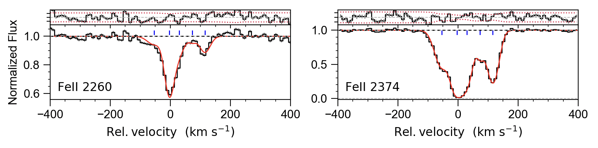
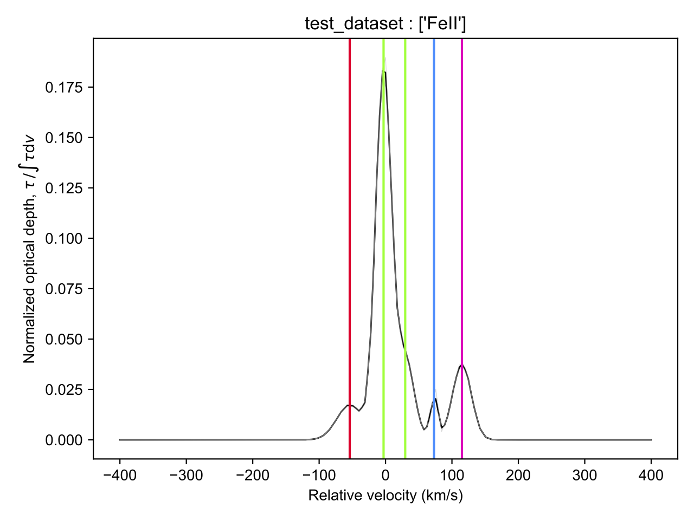

.. include:: voigtfit_logo.rst

.. _examples:

========
Examples
========

Below we will go through a few examples of how to run VoigtFit from the terminal.

Let's make a minimum configuration file:

  .. parsed-literal::

    name : test_dataset
    z_sys : 1.7941
    data  'test_data/Q1313+1441/1313_VIS_1d.spec' 25.4
    lines   FeII_2374, FeII_2260
    component FeII -54.0  27.7  12.2  velocity
    component FeII  -5.0  15.9  13.0  velocity
    component FeII  30.0  14.0  12.2  velocity
    component FeII  72.0   9.7  11.6  velocity
    component FeII 115.0  20.0  11.6  velocity
    C_order = 1

Save this to a text file – we'll call it 'test.pars'. The test spectrum is located `on GitHub
<https://github.com/jkrogager/VoigtFit>`_ under ``test_data/Q1313+1441``.
You can then simply run this example::

    %] vfit test.pars

This will run the fit using automated continuum normalization and fit only the iron lines.
The dataset will be saved to a file 'test_dataset.hdf5' and the best-fit parameters will be saved to a text file.

The best-fit should look like this:

Grouping of components
----------------------

Since many of the components in the above fit overlap and it's hard to disentangle clearly separated velocity components,
we can instead group components that are close together in velocity space. The grouping is done by identifying peaks in the
best-fit optical depth profile, where the peaks has to be "prominent" (that is, stick out by more than 1% of the peak optical depth)
to be considered an independent feature.

We use the command line tool `vfit-group` on the fitted dataset to do the grouping::

    %] vfit-group test_dataset.hdf5 --plot

This command will by default calculate the grouping on all ions defined in the fit.
The grouping is then printed and the column densities of overlapping components are summed.
The output should look like this::

    Total column densities in groups:
    ---------------------------------
    FeII
    -55.81 : 14.358 +0.023 -0.023
    -4.65 : 15.266 +0.033 -0.031
    +74.42 : 13.916 +0.091 -0.092
    +116.28 : 14.557 +0.009 -0.009

    Velocity grouping (in km/s):
    1.   -55.81: -53.94
    2.    -4.65: 29.63, -2.98
    3.   +74.42: 72.94
    4.  +116.28: 115.05

    Saved figure: test_dataset-groupings.pdf
    Wrote results to table: logN_grouped_test_dataset.csv

Where the output table contains a row for each group in the same order as above. For each group,
the table gives the total column density of that group including the lower and upper 1-sigma confidence
ranges (calculated as the 16th and 84th percentiles of the distributions assuming Gaussian uncertainties
from the best-fit column densities). The velocities are in units of km/s and all column densities are in units of :math:`{\rm cm}^{-2}`.
The table should look like this:

.. csv-table:: VoigtFit Grouping Results
   :header: velocity, logN_FeII, logN_FeII_l68, logN_FeII_u68
   :widths: 15, 20, 20, 20

    -55.814, 14.358, 0.023, 0.023
    -4.651, 15.267, 0.033, 0.032
    74.419, 13.915, 0.092, 0.092
    116.279, 14.557, 0.009, 0.009

If the ``--plot`` option is included, VoigtFit also saves a figure showing the reconstructed optical depth profile,
with the components color-coded according to the group they belong to. From the above fit, the grouping looks like this:

The ``vfit-group`` command by default calculates the normalized optical depth profile for all ions defined in the fit.
This may lead to undesirable side-effects if you're fitting multiple ionization states. VoigtFit will raise a warning in those
cases. Another pitfall can arise if you're fitting many elements with different refractory properties. In such cases, the optical
depth profiles may vary from species to species due to variations in chemical properties. It's therefore always safest to give
an explicit set of ions to use for the calculation::

    %] vfit-group dataset.hdf5 FeII CrII 

This way, you can control that the optical depth profile used for the component grouping arises from species with
similar properties.
Lastly, if you're not satisfied with the grouping, you can change the threshold value in relative prominence.
The default value is 0.01, meaning that a component needs to be more prominent that 1 percent of the peak optical depth
to be considered an independent component. You can change this by using the  ``-p`` option::

    %] vfit-group dataset.hdf5 FeII CrII -p 0.05

.. note::
    A higher value of `p` will usually lead to fewer groups, and vice versa.
